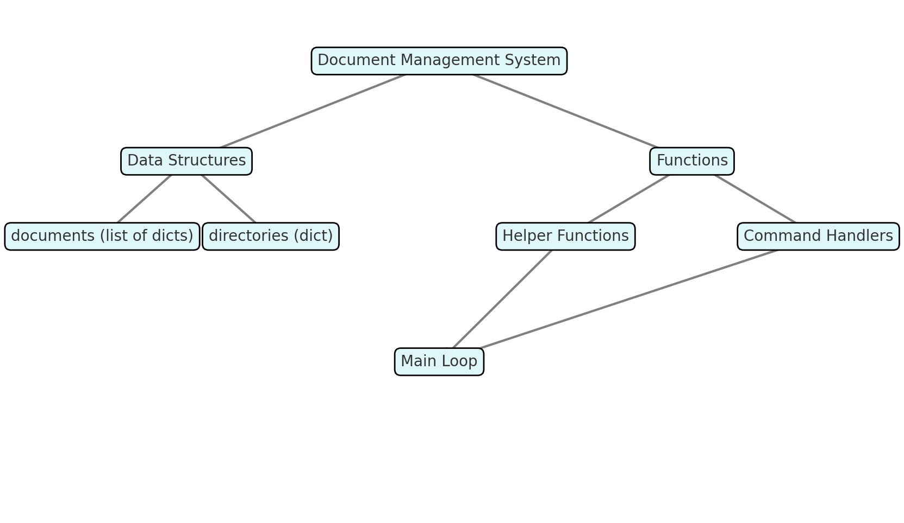

# 📚 Python Learning Portfolio

## 💡 Overview
This repository contains my Python learning projects and practice scripts, covering topics from basic syntax to algorithmic thinking, input validation, and real-world task automation.  
Each script is designed to be **self-contained**, easy to run, and follows **clean code** principles and **PEP-8** standards.

---

## 📚 Contents

- [1_middle_letter.py](./1_middle_letter.py)  
  *Finds the middle letter(s) of an input word. Handles empty and invalid input gracefully.*
- [2_sum_until_zero.py](./2_sum_until_zero.py)  
  *Calculates the sum of numbers entered by the user until zero is input. Robust to non-numeric input.*
- [3_mvp_dating_pairs.py](./3_mvp_dating_pairs.py)  
  *MVP greedy-matching for a dating service: sorts names and pairs by index.*
- [4_avg_temp_per_country.py](./4_avg_temp_per_country.py)  
  *Calculates average temperature per country in Celsius from a list of daily Fahrenheit values.*
- [5_car_plate_validation.py](./5_car_plate_validation.py)  
  *Validates Russian car plates using regex and prints status and region.*
- [6_document_management_system.py](./6_document_management_system.py)  
  *Console app for managing documents: search, add, delete, and move documents between shelves.*
- [07_purchase_log_to_funnel.py] (./07_purchase_log_to_funnel.py)
  *Processes large CSV/JSON logs: maps purchases to visits and builds a sales funnel dataset.*

## 🚀 How to Run

Clone the repository:
```bash
git clone https://github.com/<your_username>/<repo_name>.git
cd <repo_name>
```

Run a specific script:
```bash
python 1_middle_letter.py
```

> **Note:** Requires Python 3.10+  

---

## 📂 Folder Structure
```plaintext
.
├── 1_middle_letter.py
├── 2_sum_until_zero.py
├── 3_mvp_dating_pairs.py
├── 4_avg_temp_per_country.py
├── 5_car_plate_validation.py
├── 6_document_management_system.py
└── README.md
```

---

## 🌱 What I am Learning
- Clean code, documentation, and best practices
- User input validation and error handling
- Writing scripts that are safe and easy to use
- Clear structuring and English documentation for international work

---

## 🎯 Skills Practiced
- Data validation & error handling  
- Functional decomposition  
- Regular expressions (`re`)  
- File & data processing  
- Algorithm design and optimization  
- CLI interaction  
- PEP-8 compliance  

---

## ⭐ Selected Tasks

| Script                                   | Description                              | Key Learning Points                                             |
|------------------------------------------|------------------------------------------|-----------------------------------------------------------------|
| [1_middle_letter.py](./1_middle_letter.py) | Finds the middle letter(s) of a word     | String slicing · Input validation · Handling user errors       |
| [2_sum_until_zero.py](./2_sum_until_zero.py) | Sums numbers until zero is entered       | Input loop · Try/except · User guidance and error proofing     |
| [3_mvp_dating_pairs.py](./3_mvp_dating_pairs.py) | MVP: pairs users by sorted index for dating app | Greedy algorithm · Sorting · MVP logic · Business constraints |
| [4_avg_temp_per_country.py](./4_avg_temp_per_country.py) | Calculates average temperature in Celsius per country | List processing · Data transformation · Using functions        |
| [5_car_plate_validation.py](./5_car_plate_validation.py) | Validates Russian car plates (regex)     | Regular expressions · String processing · Validation logic     |
| [6_document_management_system.py](./6_document_management_system.py) | Console application to manage documents: search, add, delete, and move between shelves | Modular functions · Data structures (list/dict) · Command handling loop · Input validation · PEP-8 compliance |


## 🛠️ Tech Stack
- **Python 3**
- Python Standard Library (`re`, `math`, etc.)

---

## 📝 Next Steps
- Add unit tests for each script  
- Convert scripts into reusable modules  
- Extend functionality of **Document Management System** with file storage (JSON/CSV)  
- Build small GUI (Tkinter or PyQt) for some scripts  

---

## 🗂️ Document Management System – Architecture Diagram



---

## 🔗 Contacts
- **Email:** katsiaryna1983@icloud.com  
- **Telegram:** [@Katsiaryna_Kavaleuskaya](https://t.me/Katsiaryna_Kavaleuskaya)  


